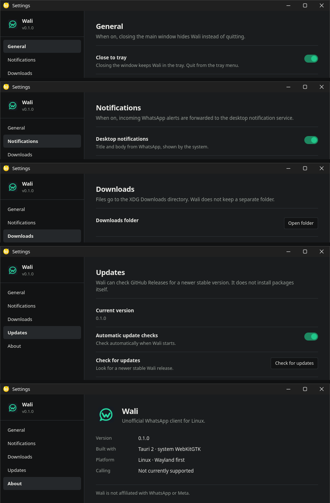
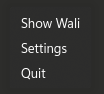

<p align="center">
  
</p>
<h1 align="center">Wali</h1>
<p align="center">
  A lightweight, Linux-native desktop home for WhatsApp Web.<br>
  Unofficial. Built for Linux, with Wayland-first desktop integration.
</p>
<p align="center">
  <a href="https://github.com/Mo999salah/wali/releases"></a>
  
  
  <a href="LICENSE"></a>
</p>
<p align="center">
  <a href="#installation">Install Wali</a> · <a href="#features">Features</a> · <a href="#build-from-source">Build from source</a>
</p>

## Preview



*All local Settings views: General, Notifications, Downloads, Updates, and About.*



*Reopen Wali, change settings, or quit from the tray.*

## WhatsApp Web, at home on Linux

Wali gives WhatsApp Web its own desktop window, with a system tray,
notifications, and everyday Linux conveniences around the familiar web app.
Your session persists between launches, so you can return to your chats
without signing in each time.

It loads the official WhatsApp Web unchanged and uses your system's WebKitGTK
instead of bundling a private Chromium runtime.

## Features

- **Stay signed in:** a persistent local session and a single app instance.
- **Keep Wali nearby:** a system tray with Show Wali, Settings, and Quit;
  optional close-to-tray keeps the app running when you close its window.
- **Use your desktop:** native notifications, downloads saved to your system
  Downloads folder, and external web links opened in your default browser.
- **Make it yours:** local Settings for close-to-tray, notifications, and
  update checks, plus quick access to your Downloads folder.
- **Discover updates:** checks for newer stable GitHub releases on native
  installations, with a notification when one is available.
- **Use supported media features:** microphone and camera permission handling
  where the WebKit environment supports it. Voice and video calling are unsupported.

## Installation

Download the **v0.1.1** package for your distribution from
[GitHub Releases](https://github.com/Mo999salah/wali/releases).
The packages below target **x86_64 / amd64** Linux systems.

### Debian / Ubuntu

Download `Wali_0.1.1_amd64.deb`, then run this from its download directory:

```bash
sudo apt install ./Wali_0.1.1_amd64.deb
```

### Fedora / RPM

Download `Wali-0.1.1-1.x86_64.rpm`, then run:

```bash
sudo dnf install ./Wali-0.1.1-1.x86_64.rpm
```

### Arch Linux / CachyOS

Install the repository-provided `wali-bin` pacman package. Its PKGBUILD
repackages the published release; it does not compile the application.
You will need Git and the standard Arch `base-devel` tools.

```bash
git clone https://github.com/Mo999salah/wali.git
cd wali/packaging/arch
makepkg -si
```

Wali is not currently published on the AUR.

## Everyday use

Launch **Wali** from your application menu and link it through WhatsApp on your
phone by scanning the login QR code. The session is stored locally for future launches.

Use the tray menu to reopen Wali or access **Settings**. With close-to-tray
enabled, closing the main window keeps Wali running; choose **Quit** from the
tray menu to exit. Notification and tray behavior depend on your desktop environment.

## Updates

Native installations check GitHub Releases for newer stable versions by default
and can notify you when one is available. Disable automatic checks or check
manually in **Settings → Updates**.

Wali does not silently install system packages. Download and install the newer
package yourself using your distribution's package tools.

## Current limitations

- WhatsApp voice and video calling are unsupported.
- Wali is Linux-focused.
- The project is in early development.

## Security & privacy

Wali loads the official [web.whatsapp.com](https://web.whatsapp.com).
It does not implement a custom WhatsApp protocol or inject JavaScript or CSS
to modify the WhatsApp interface. Wali includes no analytics or telemetry;
your use of WhatsApp Web remains subject to WhatsApp's own service and policies.

Remote WhatsApp content does not receive Wali/Tauri command capabilities.
Only the local Settings window can use its narrowly scoped commands to read
and change Wali preferences, open Downloads, and check or open releases.

## Under the hood

Wali uses **Rust**, **Tauri 2**, **GTK 3**, and the system **WebKitGTK 4.1**.
The local Settings interface is plain HTML, CSS, and JavaScript.

The remote WhatsApp WebView and local Settings WebView use separate data
directories. Tauri's capability configuration grants Settings IPC only to the
local Settings window, leaving the main remote WebView without Wali IPC capabilities.

Native distribution currently consists of `.deb`, `.rpm`, and the
repository-provided Arch/CachyOS PKGBUILD. Flatpak packaging groundwork exists
in the repository but is not currently a published distribution method.

## Build from source

You will need a Rust toolchain (`rustc` and `cargo`), a C/C++ build toolchain,
`pkg-config`, and development libraries for GTK 3, WebKitGTK 4.1, and the
AppIndicator tray integration. A desktop notification service and `xdg-utils`
provide notifications and external file/link opening at runtime.

On Arch Linux / CachyOS, a development setup is:

```bash
sudo pacman -S --needed base-devel rust gtk3 webkit2gtk-4.1 pkgconf libayatana-appindicator xdg-utils
```

This is a development example, not a distribution support matrix.
From the repository root:

```bash
cd src-tauri
cargo build --release
```

The binary is written to `src-tauri/target/release/wali`.

## Contributing

Bug reports and focused pull requests are welcome. Include your distribution,
desktop environment, Wali version, and steps to reproduce a problem.
Keep screenshots and logs free of private WhatsApp information.

A few starting points in the repository:

```text
src-tauri/       Rust/Tauri application and capability configuration
public/         Local Settings UI
packaging/       Linux package definitions
.github/        Release automation
```

## Disclaimer

Wali is unofficial and is not affiliated with, endorsed by, or associated with
WhatsApp or Meta. WhatsApp trademarks belong to their respective owners.

## License

MIT License. See [LICENSE](LICENSE).
